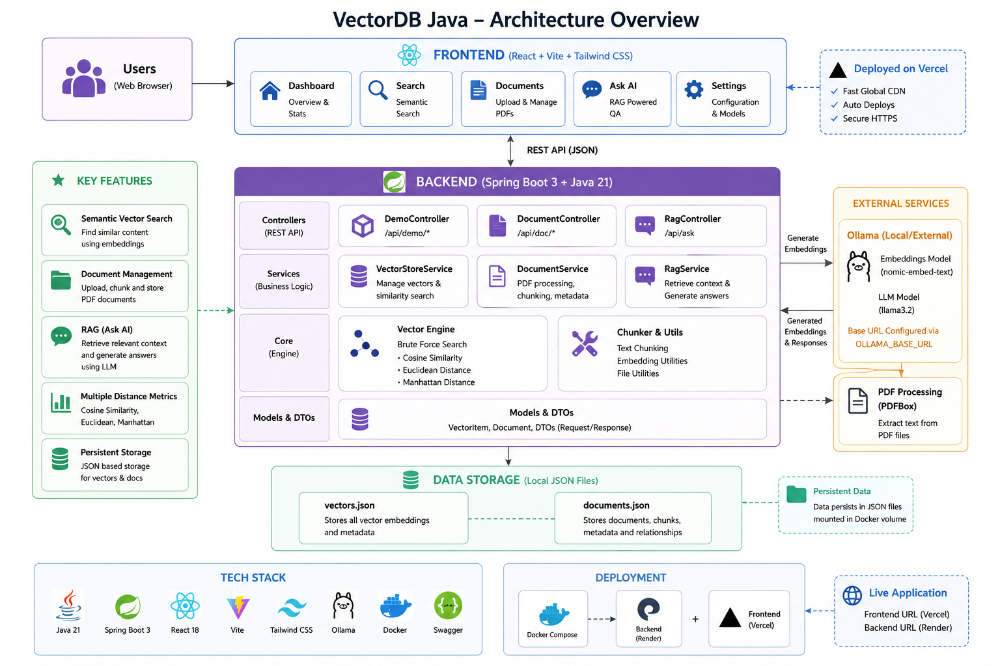

# 🚀 VectorDB Java

> A from-scratch Java implementation of a Vector Database and Retrieval-Augmented Generation (RAG) system built with Spring Boot, Ollama and React.


---

## Overview

VectorDB Java is a complete Retrieval-Augmented Generation (RAG) system implemented from scratch to understand how modern AI applications work internally.

Unlike frameworks that hide the implementation details (LangChain, Spring AI, LlamaIndex), this project manually implements:

- Vector storage
- Similarity search
- Document chunking
- Embedding generation
- Retrieval pipeline
- Prompt construction
- Local LLM integration
- REST APIs
- Modern React frontend

The objective was to build the complete backend architecture first, understand every layer, and then expose it through a production-ready frontend.

---

# Live Demo

### Frontend

> https://vector-java.vercel.app

### Backend API

> https://vector-java.onrender.com

### Swagger Documentation

> https://vector-java.onrender.com/swagger-ui/index.html

---

# Screenshots

## Architecture



---

# Features

## Vector Database

- Exact KNN Search
- Cosine Similarity
- Euclidean Distance
- Manhattan Distance
- ConcurrentHashMap storage
- Dynamic embedding dimensions
- Configurable Top-K retrieval

---

## Document Processing

- Upload raw text
- Upload PDF files
- Automatic text extraction
- Intelligent chunking
- Overlapping chunks
- Metadata management
- Persistent storage

---

## Retrieval-Augmented Generation

- Query embedding generation
- Semantic search
- Context retrieval
- Prompt construction
- Local answer generation
- Source citations
- Adjustable retrieval depth

---

## Frontend

- React + Vite
- Document upload
- PDF upload
- Semantic search
- Ask AI interface
- Document grouping
- Bulk delete
- Responsive dashboard

---

## Backend

- Spring Boot REST API
- Swagger/OpenAPI documentation
- Ollama integration
- Docker support
- JSON persistence
- Clean layered architecture

---

# Tech Stack

| Layer | Technology |
|---------|------------|
| Language | Java 21 |
| Backend | Spring Boot |
| Frontend | React + Vite |
| Build Tool | Maven |
| REST | Spring MVC |
| Documentation | Swagger / OpenAPI |
| AI Runtime | Ollama |
| Embeddings | nomic-embed-text |
| LLM | llama3.2 |
| PDF Parsing | Apache PDFBox |
| Persistence | JSON |
| Deployment | Render + Vercel |
| Containerization | Docker |

---

# Architecture

```
                User

                 │

                 ▼

         React Frontend
        (Vercel Deployment)

                 │
           REST API (JSON)

                 │

                 ▼

      Spring Boot Backend

 ┌─────────────────────────────┐
 │        Controllers          │
 ├─────────────────────────────┤
 │      Business Services      │
 ├─────────────────────────────┤
 │     Vector Search Engine    │
 ├─────────────────────────────┤
 │     Document Processing     │
 ├─────────────────────────────┤
 │       Ollama Client         │
 └─────────────────────────────┘

                 │

      ┌──────────┴───────────┐

      ▼                      ▼

 Vector Store          Metadata Store

      │                      │

      └──────────┬───────────┘

                 ▼

         JSON Persistence

                 │

                 ▼

             Ollama
    (Embeddings + LLM)
```

---

# Project Structure

```
VectorDB
│
├── backend
│   ├── controller
│   ├── service
│   ├── core
│   ├── model
│   ├── config
│   └── resources
│
├── frontend
│   ├── components
│   ├── pages
│   ├── api.js
│   └── assets
│
├── docs
│   ├── architecture.png
│   ├── screenshots
│   └── diagrams
│
├── docker-compose.yml
│
└── README.md
```

---

# Retrieval Pipeline

```
Question

      │

      ▼

Generate Query Embedding

      │

      ▼

Semantic Search

      │

      ▼

Retrieve Top-K Chunks

      │

      ▼

Build Prompt

      │

      ▼

Ollama

      │

      ▼

Grounded Answer
```

---

# Document Pipeline

```
Upload PDF

      │

      ▼

Extract Text

      │

      ▼

Chunk Text

      │

      ▼

Generate Embeddings

      │

      ▼

Store Vectors

      │

      ▼

Store Metadata

      │

      ▼

Persist JSON
```

---

# API Endpoints

## System

| Method | Endpoint |
|---------|----------|
| GET | /status |

---

## Demo

| Method | Endpoint |
|---------|----------|
| GET | /api/demo/items |
| POST | /api/demo/insert |
| DELETE | /api/demo/delete/{id} |
| POST | /api/demo/search |

---

## Documents

| Method | Endpoint |
|---------|----------|
| POST | /api/documents |
| POST | /api/documents/upload |
| GET | /api/documents |
| GET | /api/documents/grouped |
| DELETE | /api/documents/{id} |
| DELETE | /api/documents/document/{documentId} |
| POST | /api/documents/search |

---

## RAG

| Method | Endpoint |
|---------|----------|
| POST | /api/rag/ask |

---

# Running Locally

## Clone

```bash
git clone https://github.com/ManSiege14/Vector_java.git

cd Vector_java
```

---

## Backend

```bash
cd backend

mvn spring-boot:run
```

Runs on:

```
http://localhost:8080
```

---

## Frontend

```bash
cd frontend

npm install

npm run dev
```

Runs on:

```
http://localhost:5173
```

---

## Ollama

Install Ollama

Pull models

```bash
ollama pull nomic-embed-text

ollama pull llama3.2
```

Run

```bash
ollama serve
```

---

# Docker

```bash
docker compose up --build
```

---

# What I Learned

Building this project involved implementing:

- Vector databases
- Semantic search
- Embedding models
- Retrieval-Augmented Generation
- Spring Boot architecture
- REST API design
- Docker containerization
- Swagger/OpenAPI
- PDF processing
- JSON persistence
- React frontend integration
- Production deployment

---

# Future Improvements

- PostgreSQL persistence
- HNSW Approximate Nearest Neighbor indexing
- Hybrid Search (BM25 + Vector)
- Streaming LLM responses
- Authentication
- Rate limiting
- Redis caching
- Conversation memory
- Multi-user workspaces

---

# Author

**Mansij**

GitHub

https://github.com/ManSiege14

---

⭐ If you found this project useful, consider giving it a star.